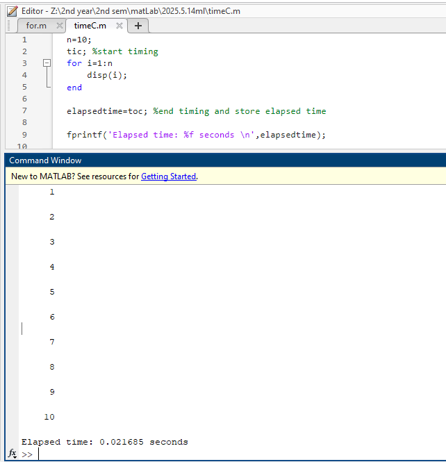
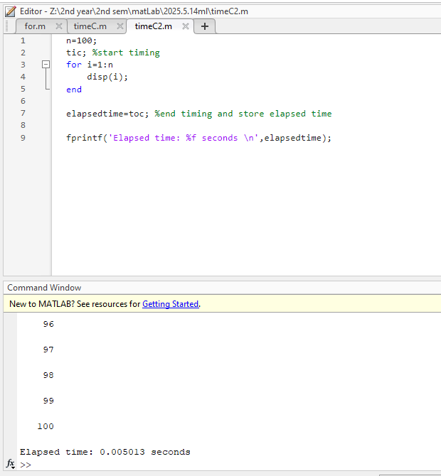
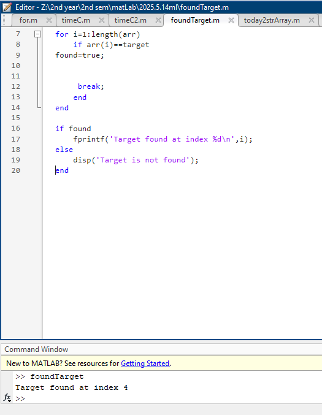
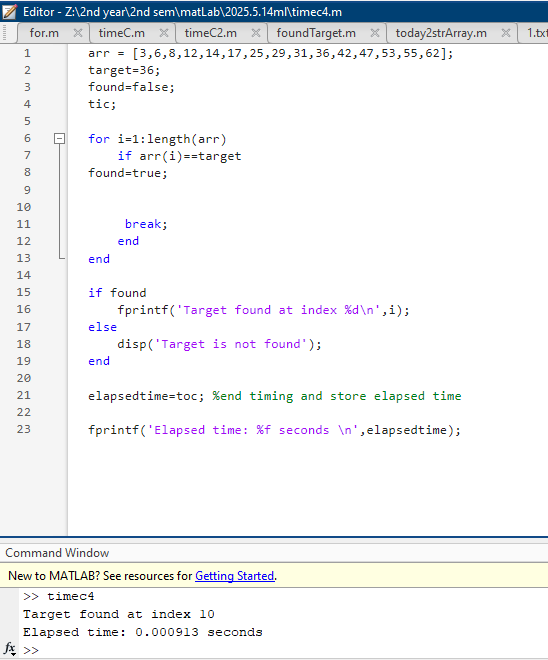
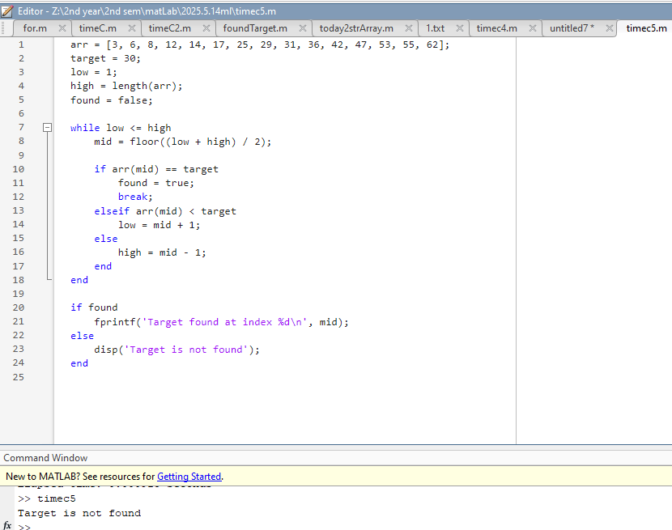

# Folder Contents: 2025.5.14ml

This folder contains MATLAB scripts and related outputs for searching algorithms and timing demonstrations.

## MATLAB Scripts
- `foundTargetC3.m` - Linear search for a target value in an array
- `timeC1.m` - Timing a simple loop
- `timeC2.m` - Timing a loop with more iterations
- `timec4.m` - Linear search with timing
- `timec5.m` - Binary search implementation

## Text Files
- `1.txt` - Example code for linear search

## Output Images
- `1.png`, `2.png`, `3.png`, `4.png`, `5.png` - Output screenshots or visualizations from the scripts

All files and outputs are directly from this folder's directory.