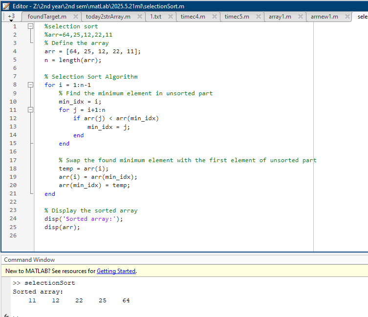

# Folder Contents: 2025.5.21ml

This folder contains MATLAB scripts and outputs for sorting and search comparison exercises.

## MATLAB Scripts
- `selectionSort.m` - Selection sort algorithm implementation
- `array1.m` - Compare linear and binary search performance on a large array
- `arrnew1.m` - Additional comparison of linear and binary search

## Output Images
- `sele.png` - Output or visualization from the scripts

### Output Preview

All files and outputs are directly from this folder's directory.