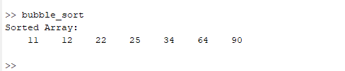
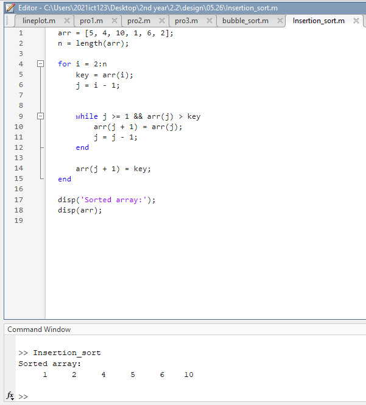

# Folder Contents: 2025.5.26ml

This folder contains MATLAB scripts and outputs for sorting algorithm demonstrations.

## MATLAB Scripts
- `bubble_sort.m` - Bubble sort algorithm implementation
- `Insertion_sort.m` - Insertion sort algorithm implementation

## Text Files
- `sort.txt` - Bubble sort code and explanation

## Output Images
- `output/1.png`, `output/2.png` - Output screenshots or visualizations from the scripts

All files and outputs are directly from this folder's directory and its output subfolder.